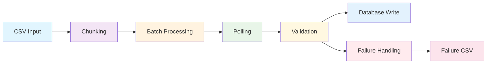

# Batch Document Processing Workflow

This document describes the complete workflow for batch document processing using Exosphere.

## Workflow Overview

The batch document processing workflow consists of 7 main nodes that work together to process documents in batches, extract information using Google Gemini, and store the results in a database.

## Node Flow



## Detailed Node Descriptions

### 1. CSVInputNode
- **Purpose**: Reads file paths from a CSV input file
- **Inputs**: 
  - `csv_file_path`: Path to the CSV file containing document paths
- **Outputs**: 
  - `file_paths`: JSON string containing array of file paths
- **Function**: Parses CSV file and extracts file paths from the first column

### 2. ChunkingNode
- **Purpose**: Creates chunks of file paths for batch processing
- **Inputs**: 
  - `file_paths`: JSON string containing array of file paths
  - `chunk_size`: Size of each chunk (default: 10)
- **Outputs**: 
  - `chunk`: JSON string containing a chunk of file paths
- **Function**: Splits file paths into manageable chunks for parallel processing

### 3. BatchProcessingNode
- **Purpose**: Processes each chunk as a batch and sends to Gemini
- **Inputs**: 
  - `chunk`: JSON string containing chunk of file paths
  - `prompt`: Processing prompt for Gemini
- **Outputs**: 
  - `task_id`: Unique task ID for tracking
  - `batch_info`: JSON string with batch information
- **Secrets**: 
  - `gemini_api_key`: Gemini API key
- **Function**: Sends batch to Gemini endpoint and returns task ID

### 4. PollingNode
- **Purpose**: Polls for task completion with requeue mechanism
- **Inputs**: 
  - `task_id`: Task ID to poll for
  - `batch_info`: JSON string with batch information
- **Outputs**: 
  - `task_result`: JSON string with task results
  - `status`: Status of the task (completed, failed, pending)
- **Secrets**: 
  - `gemini_api_key`: Gemini API key
- **Function**: Polls Gemini for task completion, requeues if not complete

### 5. ValidationNode
- **Purpose**: Validates extracted JSON information
- **Inputs**: 
  - `task_result`: JSON string with task results
  - `batch_info`: JSON string with batch information
- **Outputs**: 
  - `validated_data`: JSON string with validated data
  - `validation_status`: Status of validation (valid, invalid, partial)
- **Function**: Validates extracted JSON against schema and performs quality checks

### 6. DatabaseWriteNode
- **Purpose**: Writes validated information to database
- **Inputs**: 
  - `validated_data`: JSON string with validated data
  - `batch_info`: JSON string with batch information
- **Outputs**: 
  - `write_status`: Status of database write operation
  - `record_count`: Number of records written
- **Secrets**: 
  - `database_url`: Database connection string
- **Function**: Writes validated data to MongoDB database

### 7. FailureHandlingNode
- **Purpose**: Handles validation failures and creates retry CSV
- **Inputs**: 
  - `validation_status`: Status of validation
  - `batch_info`: JSON string with batch information
  - `task_result`: JSON string with task results
- **Outputs**: 
  - `failure_csv_path`: Path to the failure CSV file
  - `retry_count`: Number of files that need retry
- **Function**: Creates failure CSV for documents that need retry

## Data Flow

### Input Data
- CSV file with document paths
- Processing prompt
- Chunk size parameter

### Processing Data
- File paths are chunked into batches
- Each batch is sent to Gemini for processing
- Results are polled until completion
- Extracted data is validated

### Output Data
- Validated data stored in database
- Failure CSV for retry mechanism
- Processing statistics and logs

## Error Handling

### Validation Failures
- Documents with invalid extracted data are logged
- Failure CSV is created with retry information
- Failed documents can be reprocessed

### API Failures
- Gemini API failures are handled gracefully
- Tasks are requeued with exponential backoff
- Timeout handling for long-running tasks

### Database Failures
- Database connection issues are logged
- Partial writes are handled appropriately
- Transaction rollback on critical failures

## Retry Mechanism

### Failure CSV Format
```csv
file_path,failure_reason,task_id,timestamp
/path/to/doc1.pdf,missing_title,task-123,2024-01-01T12:00:00Z
/path/to/doc2.docx,content_too_short,task-123,2024-01-01T12:00:00Z
```

### Retry Process
1. Failed documents are logged to failure CSV
2. Failure CSV can be used as input for retry
3. Retry count is tracked to prevent infinite loops
4. Exponential backoff for API retries

## Performance Considerations

### Batch Size
- Optimal batch size depends on document complexity
- Larger batches reduce API calls but increase processing time
- Default batch size of 10 is recommended

### Polling Strategy
- Polling interval starts at 5 seconds
- Maximum 10 polling attempts
- Exponential backoff for failed requests

### Database Optimization
- Indexes on task_id, file_path, and status
- JSONB for flexible extracted data storage
- Connection pooling for high throughput

## Monitoring and Logging

### Log Levels
- **DEBUG**: Detailed processing information
- **INFO**: General workflow progress
- **WARNING**: Non-critical issues
- **ERROR**: Critical failures

### Key Metrics
- Total documents processed
- Success/failure rates
- Processing time per batch
- API response times

### Health Checks
- Database connectivity
- Gemini API availability
- File system access
- Memory and CPU usage

## Security Considerations

### API Keys
- Gemini API key stored as secret
- Database credentials in environment variables
- No hardcoded credentials in code

### Data Privacy
- Document paths are logged (ensure no sensitive data in paths)
- Extracted data stored in secure database
- Access controls on database

### Input Validation
- CSV file format validation
- File path sanitization
- Prompt injection prevention


### Common Issues
1. **CSV file not found**: Check file path and permissions
2. **Gemini API errors**: Verify API key and rate limits
3. **Database connection failed**: Check connection string and network
4. **Validation failures**: Review prompt and document format

### Debug Steps
1. Check logs for error messages
2. Verify environment variables
3. Test database connectivity
4. Validate CSV file format
5. Check Gemini API status

### Recovery Procedures
1. Restart failed nodes
2. Retry with failure CSV
3. Check database integrity
4. Verify file system access
5. Monitor resource usage
