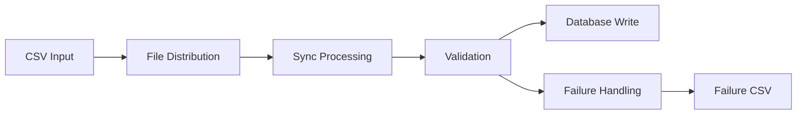

# Sync Document Processing Workflow

This document describes the complete workflow for sync document processing using Exosphere.

## Workflow Overview

The sync document processing workflow consists of 6 main nodes that work together to process documents one at a time, extract information using Google Gemini's real-time API, and store the results in a database immediately.

## Node Flow



## Detailed Node Descriptions

### 1. CSVInputNode
- **Purpose**: Reads file paths from a CSV input file
- **Inputs**: 
  - `csv_file_path`: Path to the CSV file containing document paths
- **Outputs**: 
  - `file_paths`: JSON string containing array of file paths
- **Function**: Parses CSV file and extracts file paths from the first column

### 2. FileDistributionNode
- **Purpose**: Creates individual processing tasks for each document
- **Inputs**: 
  - `file_paths`: JSON string containing array of file paths
- **Outputs**: 
  - `file_path`: JSON string containing a single file path
- **Function**: Distributes file paths into individual states for parallel processing

### 3. SyncProcessingNode
- **Purpose**: Processes each document individually using Gemini's real-time API
- **Inputs**: 
  - `file_path`: JSON string containing a single file path
  - `prompt`: Processing prompt for Gemini
- **Outputs**: 
  - `task_id`: Unique task ID for tracking
  - `file_info`: JSON string with file information and results
- **Secrets**: 
  - `gemini_api_key`: Gemini API key
- **Function**: Sends individual document to Gemini real-time API and returns immediate results

### 4. ValidationNode
- **Purpose**: Validates extracted JSON information from a single document
- **Inputs**: 
  - `file_info`: JSON string with file processing information
- **Outputs**: 
  - `validated_result`: JSON string with validated result
  - `file_info`: JSON string with file information
- **Function**: Validates extracted JSON against schema and performs quality checks

### 5. DatabaseWriteNode
- **Purpose**: Writes validated information to database immediately
- **Inputs**: 
  - `validated_result`: JSON string with validated result
  - `file_info`: JSON string with file information
- **Outputs**: 
  - `write_status`: Status of database write operation
- **Secrets**: 
  - `database_url`: Database connection string
- **Function**: Writes validated data to PostgreSQL database immediately

### 6. FailureHandlingNode
- **Purpose**: Handles validation failures and creates retry CSV
- **Inputs**: 
  - `validated_result`: JSON string with validated result
  - `file_info`: JSON string with file information
- **Outputs**: 
  - `failure_status`: Status of failure handling
- **Function**: Creates failure CSV for documents that need retry

## Data Flow

### Input Data
- CSV file with document paths
- Processing prompt

### Processing Data
- File paths are distributed into individual processing tasks
- Each document is sent to Gemini's real-time API for immediate processing
- Results are validated immediately upon receipt
- Extracted data is stored in database as soon as validation completes

### Output Data
- Validated data stored in database immediately
- Failure CSV for retry mechanism
- Processing statistics and logs

## Key Differences from Batch Processing

### Real-time Processing
- **No batching**: Each document is processed individually
- **Immediate results**: No waiting for batch completion
- **Real-time API**: Uses Gemini's real-time API instead of batch API
- **Instant feedback**: Results available as soon as each document is processed

### Simplified Workflow
- **No polling**: No need to poll for completion since real-time API returns immediately
- **No result splitting**: Each document produces one result
- **Direct processing**: File → Processing → Validation → Database

## Error Handling

### Validation Failures
- Documents with invalid extracted data are logged
- Failure CSV is created with retry information
- Failed documents can be reprocessed individually

### API Failures
- Gemini API failures are handled gracefully
- Individual document failures don't affect other documents
- Immediate error reporting and retry capability

### Database Failures
- Database connection issues are logged
- Individual document writes are handled independently
- Transaction rollback on critical failures

## Retry Mechanism

### Failure CSV Format
```csv
file_path,task_id,error,timestamp
/path/to/doc1.pdf,task-123,validation_failed,2024-01-01T12:00:00Z
/path/to/doc2.docx,task-124,api_error,2024-01-01T12:00:00Z
```

### Retry Process
1. Failed documents are logged to failure CSV
2. Failure CSV can be used as input for retry
3. Retry count is tracked to prevent infinite loops
4. Individual document retry without affecting others

## Performance Considerations

### Real-time Processing
- Each document processed immediately upon request
- No waiting for batch completion
- Better for real-time applications
- Lower latency per document

### API Usage
- More API calls compared to batch processing
- Higher cost per document due to real-time API pricing
- Better for applications requiring immediate results
- No rate limiting issues with batch API

### Database Optimization
- Individual writes to database
- Indexes on task_id, file_path, and status
- JSONB for flexible extracted data storage
- Connection pooling for high throughput

## Monitoring and Logging

### Log Levels
- **DEBUG**: Detailed processing information
- **INFO**: General workflow progress
- **WARNING**: Non-critical issues
- **ERROR**: Critical failures

### Key Metrics
- Total documents processed
- Success/failure rates per document
- Processing time per document
- API response times
- Real-time throughput

### Health Checks
- Database connectivity
- Gemini API availability
- File system access
- Memory and CPU usage

## Security Considerations

### API Keys
- Gemini API key stored as secret
- Database credentials in environment variables
- No hardcoded credentials in code

### Data Privacy
- Document paths are logged (ensure no sensitive data in paths)
- Extracted data stored in secure database
- Access controls on database

### Input Validation
- CSV file format validation
- File path sanitization
- Prompt injection prevention

## Troubleshooting

### Common Issues
1. **CSV file not found**: Check file path and permissions
2. **Gemini API errors**: Verify API key and rate limits
3. **Database connection failed**: Check connection string and network
4. **Validation failures**: Review prompt and document format
5. **Real-time API timeouts**: Check document size and complexity

### Debug Steps
1. Check logs for error messages
2. Verify environment variables
3. Test database connectivity
4. Validate CSV file format
5. Check Gemini API status
6. Test with single document first

### Recovery Procedures
1. Restart failed nodes
2. Retry with failure CSV
3. Check database integrity
4. Verify file system access
5. Monitor resource usage
6. Test individual document processing

## When to Use Sync vs Batch Processing

### Use Sync Processing When:
- You need immediate results for each document
- Processing documents as they arrive
- Real-time applications
- Interactive document analysis
- Lower document volumes
- Cost is not the primary concern

### Use Batch Processing When:
- Processing large volumes of documents
- Cost optimization is important
- You can wait for batch completion
- Bulk document processing
- Higher throughput requirements
- Batch API pricing is preferred
